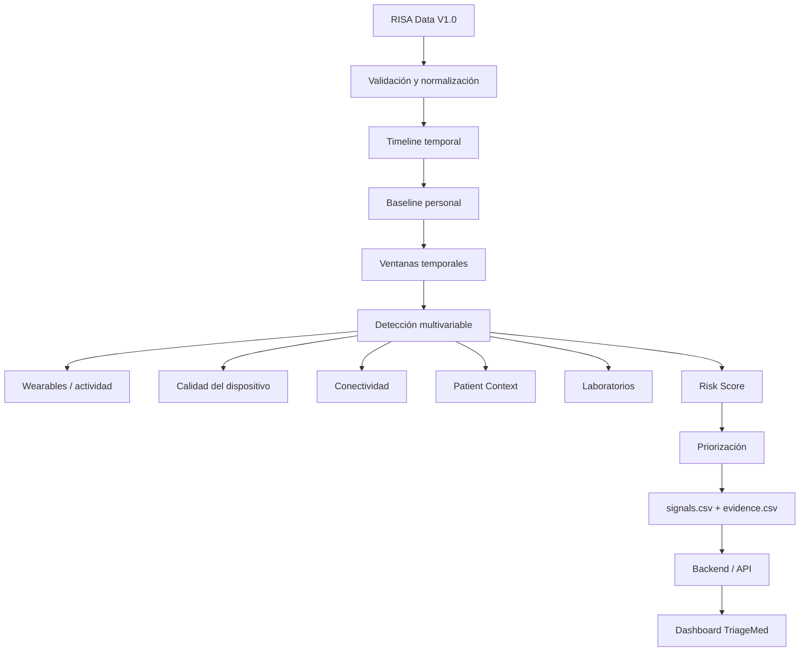

# 1. Encabezado

TriageMed es un prototipo desarrollado para HealthSignal LATAM utilizando
RISA Data V1.0.

El sistema integra información fisiológica, clínica, contextual y tecnológica
para identificar desviaciones respecto del comportamiento basal de cada
paciente, analizar su persistencia temporal, priorizar señales y proporcionar
evidencia trazable disponible al momento de la decisión.

Cabe aclarar que:

- TriageMed es una herramienta tecnológica de apoyo.
- No genera diagnósticos, prescripciones ni decisiones clínicas autónomas.

# 2. Problema

Los datos de salud pueden encontrarse fragmentados entre signos vitales,
wearables, laboratorios, dispositivos y fuentes contextuales.

Una alteración individual no necesariamente representa una situación relevante.
TriageMed busca analizar conjuntamente la evolución temporal, el baseline
personal, el contexto y la calidad de los datos para detectar patrones que
merecen revisión profesional.

# 3. Arquitectura

La arquitectura implementada es la siguiente:



# 4. Fuentes RISA utilizadas

Las fuentes RISA utilizadas fueron:

- vital_signs.csv
- wearable_observations.csv
- device_observations.csv
- patient_context.csv
- connectivity_events.csv
- laboratory_results.csv

# 5. Tecnologías utilizadas

Se emplearon las siguientes tecnologías:

## Procesamiento y Análisis

- Python
- Pandas
- Numpy
- DuckDB (consultas SQL sobre los datos crudos en `scripts/process_data.py` y `src/preprocessing`)

## Backend

- Python
- FastAPI
- Uvicorn
- Pydantic (v2, con soporte de email)
- SQLAlchemy (usuarios/autenticación en SQLite)
- python-jose (JWT)
- Passlib (hash de contraseñas, `pbkdf2_sha256`)
- pyarrow (lectura de los `.parquet` de condiciones/medicaciones)

## Frontend

- TypeScript
- Next.js 14 (App Router)
- React 18
- jose (verificación de JWT en middleware)
- CSS plano con variables (sin librería de UI ni de gráficos)

## Persistencia / Resultados

- CSV (`results/signals.csv`, `results/evidence.csv`) como fuente de verdad de señales/evidencia
- Parquet (`K3RNEL/healthsignal/data/processed/*.parquet`) para condiciones y administraciones de medicación
- SQLite (usuarios de autenticación del backend)

## Herramientas de Desarrollo

- Git / GitHub
- npm (gestor de paquetes frontend)
- pip + entorno virtual `.venv` (backend)
- ESLint/TypeScript compiler (`tsc --noEmit`, `next lint`) para verificación

# 6. Instalación

## Requisitos Previos

- Python 3.12+
- Node.js 20+ (con npm)
- Git

## Instalación y ejecución

### 1. Clonar el repositorio

```bash
git clone https://github.com/K3RNEL-Organization/Hackathon-Internacional.git
cd Hackathon-Internacional
```

### 2. Backend (FastAPI)

```bash
cd backend
python -m venv .venv
```

#### PowerShell

```powershell
.venv\Scripts\Activate.ps1
```

#### CMD

```cmd
.venv\Scripts\activate.bat
```

Instalar dependencias:

```bash
pip install -r requirements.txt
```

Levantar el servidor:

```bash
uvicorn app.main:app --reload --port 8000
```

El backend queda disponible en:

`http://localhost:8000`

Al arrancar, crea automáticamente una base SQLite local con dos usuarios de prueba, uno por cada rol.

### 3. Frontend (Next.js)

```bash
cd frontend
```

#### Windows

```cmd
copy .env.local.example .env.local
```

#### Linux / macOS

```bash
cp .env.local.example .env.local
```

Instalar dependencias y levantar el servidor:

```bash
npm install
npm run dev
```

El frontend queda disponible en:

`http://localhost:3000`

### 4. Uso

Con ambos servidores corriendo, abrir:

`http://localhost:3000`

Iniciar sesión con alguno de los usuarios de prueba definidos en:

`backend/app/seed.py`


