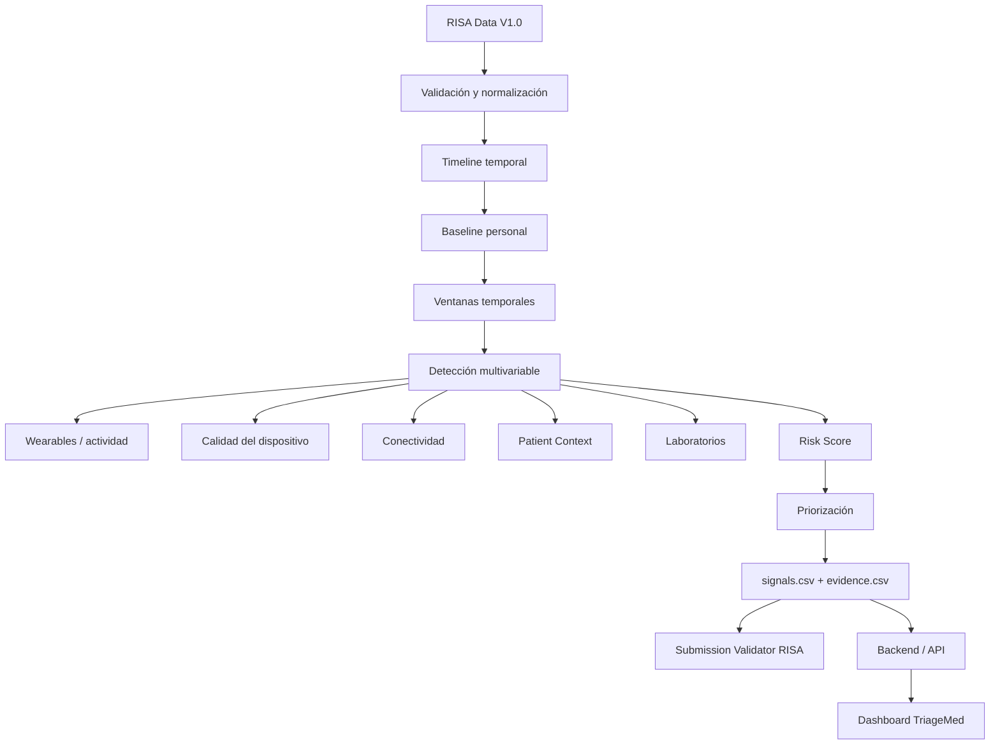

# TriageMed — HealthSignal LATAM / RISA Data V1.0

**Detección temprana, priorización y evidencia trazable con datos multifuente.**

TriageMed es un prototipo desarrollado para el desafío **HealthSignal LATAM** utilizando **RISA Data V1.0**.

El sistema integra información fisiológica, clínica, contextual y tecnológica para identificar desviaciones respecto del comportamiento basal de cada paciente, analizar su persistencia temporal, priorizar señales y proporcionar evidencia trazable que se encontraba disponible al momento de la decisión.

> **Importante:** TriageMed es una herramienta tecnológica de apoyo. No genera diagnósticos, prescripciones ni decisiones clínicas autónomas.

---

# 1. Problema

Los datos de salud pueden encontrarse fragmentados entre signos vitales, wearables, laboratorios, dispositivos y fuentes contextuales.

Una alteración individual no necesariamente representa una situación relevante. Una variación puede deberse, por ejemplo, a actividad física, calidad de la señal, conectividad o características propias del paciente.

TriageMed busca analizar conjuntamente:

- evolución temporal;
- baseline individual;
- combinación de múltiples variables;
- persistencia de las desviaciones;
- actividad y contexto;
- calidad de los dispositivos;
- disponibilidad temporal de la información.

El objetivo es transformar grandes volúmenes de datos heterogéneos en señales priorizadas, explicables y trazables que faciliten la revisión profesional.

---

# 2. Arquitectura

La arquitectura implementada es la siguiente:



El flujo implementado puede resumirse como:

```text
RISA Data V1.0
      ↓
Validación y normalización
      ↓
Timeline disponible por paciente
      ↓
Baseline individual
      ↓
Ventanas temporales
      ↓
Detección multivariable
      ↓
Persistencia + contexto + calidad
      ↓
Risk Score
      ↓
Priorización
      ↓
Evidencia trazable
      ↓
signals.csv + evidence.csv
      ↓
Backend / API
      ↓
Dashboard TriageMed
```

La arquitectura representa el prototipo efectivamente implementado.

---

# 3. Fuentes RISA utilizadas

El motor de detección y contextualización utiliza principalmente:

- `vital_signs.csv`
- `wearable_observations.csv`
- `device_observations.csv`
- `patient_context.csv`
- `connectivity_events.csv`
- `laboratory_results.csv`

Los datos son integrados principalmente mediante `patient_id` y relaciones temporales.

`patients.csv` también se utiliza como referencia maestra de los pacientes procesados.

Las diferentes fuentes no se interpretan de la misma manera. Cada una conserva su función semántica dentro del análisis.

Por ejemplo:

- los signos vitales constituyen la principal fuente fisiológica;
- los wearables permiten contextualizar actividad;
- `device_observations.csv` aporta información de calidad;
- los eventos de conectividad explican posibles interrupciones o retrasos;
- `patient_context.csv` aporta información contextual;
- los laboratorios disponibles pueden incorporarse como evidencia de apoyo.

---

# 4. Tecnologías utilizadas

## Procesamiento y análisis

- Python
- Pandas
- NumPy
- DuckDB
- PyArrow

DuckDB es utilizado para consultas sobre datos crudos dentro de componentes como:

```text
scripts/process_data.py
src/preprocessing/
```

## Backend

- Python
- FastAPI
- Uvicorn
- Pydantic v2
- SQLAlchemy
- SQLite
- python-jose
- Passlib
- PyArrow

El backend expone los resultados producidos por el pipeline y administra la autenticación del prototipo.

## Frontend

- TypeScript
- Next.js 14
- React 18
- jose
- CSS con variables

El frontend utiliza **Next.js App Router** y no recalcula el `risk_score` ni modifica la prioridad generada por el pipeline.

## Persistencia y resultados

- CSV:
  - `results/signals.csv`
  - `results/evidence.csv`
- Parquet:
  - `data/processed/*.parquet`
- SQLite:
  - usuarios de autenticación del backend

## Herramientas de desarrollo

- Git
- GitHub
- npm
- pip
- entornos virtuales de Python
- ESLint
- TypeScript Compiler

---

# 5. Estructura general del proyecto

La solución se encuentra organizada en los siguientes componentes:

```text
Hackathon-Internacional/
│
├── 02_KIT_ENTREGA/     # Recursos asociados a la entrega
│
├── backend/             # API, autenticación y servicios backend
│
├── frontend/            # Interfaz web de TriageMed
│
├── K3RNEL/              # Recursos y datos utilizados por el proyecto
│
├── results/             # Resultados finales del pipeline
│   ├── signals.csv
│   └── evidence.csv
│
├── scripts/             # Scripts auxiliares de procesamiento y validación
│
├── src/                 # Procesamiento, preprocessing y motor de riesgo
│
├── .gitignore
├── pautas-UI.md         # Documentación de interfaz
├── README.md            # Documentación técnica principal
└── run_all.py           # Ejecución integral del pipeline
``` 

---

# 6. Dependencias principales

Las dependencias exactas utilizadas por cada componente se encuentran declaradas en:

```text
backend/requirements.txt
frontend/package.json
```

Entre las dependencias principales se encuentran:

### Procesamiento

- pandas
- numpy
- duckdb
- pyarrow

### Backend

- fastapi
- uvicorn
- pydantic
- sqlalchemy
- python-jose
- passlib

### Frontend

- next
- react
- typescript
- jose

---

# 7. Instalación y ejecución

## Requisitos previos

- Python 3.12
- Node.js 20+
- npm
- Git

---

## 7.1. Clonar el repositorio

```bash
git clone https://github.com/K3RNEL-Organization/Hackathon-Internacional.git
cd Hackathon-Internacional
```

---

## 7.2. Backend

Ingresar al backend:

```bash
cd backend
```

Crear el entorno virtual:

```bash
python -m venv .venv
```

### PowerShell

```powershell
.venv\Scripts\Activate.ps1
```

### CMD

```cmd
.venv\Scripts\activate.bat
```

### Linux / macOS

```bash
source .venv/bin/activate
```

Instalar dependencias:

```bash
pip install -r requirements.txt
```

Levantar FastAPI:

```bash
uvicorn app.main:app --reload --port 8000
```

El backend queda disponible en:

```text
http://localhost:8000
```

Al arrancar, el backend crea una base SQLite local con usuarios de prueba para los roles implementados en el MVP.

---

## 7.3. Frontend

Desde la raíz del repositorio:

```bash
cd frontend
```

### Windows

```cmd
copy .env.local.example .env.local
```

### Linux / macOS

```bash
cp .env.local.example .env.local
```

Instalar dependencias:

```bash
npm install
```

Levantar el frontend:

```bash
npm run dev
```

El frontend queda disponible en:

```text
http://localhost:3000
```

---

## 7.4. Uso

Con backend y frontend funcionando, abrir:

```text
http://localhost:3000
```

Los usuarios de demostración se encuentran definidos en:

```text
backend/app/seed.py
```

---

# 8. Regeneración de resultados

El pipeline principal de TriageMed corresponde a:

```text
src/risk/run_pipeline_v03.py
```

Los resultados completos pueden regenerarse desde la raíz mediante:

```bash
python run_all.py
```

Este proceso:

```text
1. ejecuta el pipeline de detección;
2. genera results/signals.csv;
3. genera results/evidence.csv;
4. ejecuta el validador de entrega.
```

Los archivos utilizados por el pipeline deben encontrarse en la estructura de datos esperada por el proyecto dentro de:

```text
data/raw/
data/processed/
```

Los archivos originales de RISA no son sobrescritos. Las transformaciones se almacenan en capas derivadas reproducibles.

---

# 9. Procedimiento para reproducir la demostración

Para reproducir la demostración utilizada por el equipo:

### Paso 1 — Obtener el repositorio

```bash
git clone https://github.com/K3RNEL-Organization/Hackathon-Internacional.git
cd Hackathon-Internacional
```

### Paso 2 — Regenerar las señales

Con el entorno Python y los datos RISA disponibles:

```bash
python run_all.py
```

El proceso debe producir:

```text
results/signals.csv
results/evidence.csv
```

### Paso 3 — Levantar el backend

```bash
cd backend
uvicorn app.main:app --reload --port 8000
```

### Paso 4 — Levantar el frontend

En otra terminal:

```bash
cd frontend
npm run dev
```

### Paso 5 — Abrir TriageMed

```text
http://localhost:3000
```

### Paso 6 — Flujo de demostración

La demostración permite recorrer el siguiente flujo:

```text
Dashboard
    ↓
Señales priorizadas
    ↓
Paciente asociado
    ↓
Detalle de señal
    ↓
Variables involucradas
    ↓
Evolución temporal
    ↓
Risk Score y prioridad
    ↓
Explicación
    ↓
Evidencia trazable
```

Cada señal puede relacionarse con registros concretos de `evidence.csv`.

---

# 10. Mecanismo de análisis y priorización

## 10.1. Validación y normalización

Antes de ejecutar el detector, los datos atraviesan una etapa de validación y preparación.

Entre las políticas aplicadas se encuentran:

- normalización de unidades;
- detección de valores fuera de plausibilidad;
- tratamiento de retransmisiones;
- conservación de indicadores de calidad;
- tratamiento explícito de temporalidad;
- preservación de los datos originales.

Los valores fuera de plausibilidad no se eliminan automáticamente. Se marcan para evitar convertir una regla de limpieza en una decisión clínica implícita.

Las retransmisiones se conservan para trazabilidad, pero no deben interpretarse como nuevos eventos fisiológicos.

---

## 10.2. Baseline individual

Para cada paciente se utilizan las primeras **24 horas de datos válidos** como período inicial de calibración.

Para cada variable se calculan estadísticas como:

- media;
- mediana;
- desviación estándar.

Variables fisiológicas utilizadas:

- HR
- RR
- SpO2
- TEMP
- SBP
- DBP

El objetivo es evaluar las variaciones respecto del comportamiento individual del paciente en lugar de depender únicamente de límites globales estáticos.

---

## 10.3. Ventanas temporales

El detector analiza:

```text
Ventana de análisis: 4 horas
Frecuencia de decisión: 1 hora
```

Para cada ventana se calcula la desviación respecto del baseline individual mediante **z-score**.

Una ventana candidata requiere:

```text
|z-score| >= 2
```

en al menos:

```text
2 variables
```

Para confirmar una señal se requieren al menos:

```text
2 ventanas consecutivas
```

Estos valores son **parámetros de ingeniería del MVP** y no representan umbrales clínicos oficiales.

---

## 10.4. Contexto

Una desviación fisiológica no se evalúa de forma aislada.

### Actividad

La información proveniente de wearables permite identificar actividad física dentro de la ventana.

Cuando existe actividad moderada o alta durante una parte significativa del período, el contexto puede reducir la relevancia asignada a determinadas desviaciones.

### Calidad

Los indicadores provenientes de dispositivos permiten estimar la calidad disponible de la señal.

La calidad afecta la confianza asociada al resultado.

### Conectividad

Los eventos:

```text
DISCONNECTED
INTERMITTENT
DELAYED_SYNC
```

se utilizan como evidencia tecnológica o de calidad.

Un problema de conectividad **no se interpreta automáticamente como señal clínica**.

### Laboratorios

Los resultados de laboratorio disponibles durante una ventana pueden incorporarse como evidencia `SUPPORTING`.

Los valores `reference_low` y `reference_high` se utilizan como contexto y no como disparadores automáticos de una alerta.

---

# 11. Risk Score y priorización

El `risk_score` se encuentra entre:

```text
0.0 y 1.0
```

El mecanismo combina componentes asociados a:

- magnitud de la desviación;
- cantidad de variables involucradas;
- persistencia temporal;
- calidad disponible;
- contexto de actividad.

El score se utiliza para ordenar y priorizar señales.

La clasificación actual del MVP es:

| Risk Score | Prioridad |
|---|---|
| `< 0.30` | LOW |
| `0.30 - 0.49` | MEDIUM |
| `0.50 - 0.74` | HIGH |
| `>= 0.75` | CRITICAL |

Estas categorías son parte del mecanismo tecnológico de priorización y **no representan diagnósticos ni categorías clínicas oficiales**.

---

# 12. Risk Score y Confidence Score

TriageMed diferencia entre dos conceptos:

### Risk Score

```text
risk_score
```

Representa la prioridad estimada de la señal de acuerdo con el algoritmo.

### Confidence Score

```text
confidence_score
```

Representa la confianza/calidad de la evidencia disponible para esa señal.

Por lo tanto:

```text
risk_score != confidence_score
```

Una confianza alta no significa una probabilidad alta de enfermedad.

---

# 13. Causalidad temporal

La temporalidad es un componente central del sistema.

TriageMed diferencia:

```text
event_datetime
available_datetime
decision_datetime
```

- `event_datetime`: cuándo ocurrió el evento;
- `available_datetime`: cuándo la información estuvo disponible para el sistema;
- `decision_datetime`: momento en el que TriageMed generó la señal.

La regla aplicada es:

```text
available_datetime <= decision_datetime
```

Esto evita utilizar información futura para justificar una decisión pasada.

Ejemplos:

### Signos vitales

```text
event time        = timestamp
availability time = timestamp
```

### Wearables

```text
event time        = timestamp
availability time = sync_datetime
```

### Laboratorios

```text
event time        = sample_datetime
availability time = result_datetime
```

Un laboratorio tomado antes de una señal pero cuyo resultado todavía no estaba disponible **no puede ser utilizado como evidencia para esa decisión**.

---

# 14. Explicabilidad y trazabilidad

Cada señal generada puede regresar a los registros que participaron en su análisis.

## `results/signals.csv`

Contiene una fila por señal.

Entre sus campos se encuentran:

```text
signal_id
patient_id
decision_datetime
risk_score
priority_level
confidence_score
evidence_start
evidence_end
explanation
model_version
```

## `results/evidence.csv`

Contiene los registros que justifican o contextualizan cada señal.

Cada evidencia conserva información como:

```text
signal_id
source_file
record_id
variable_code
event_datetime
available_datetime
evidence_role
contribution
```

La relación se realiza mediante:

```text
signals.signal_id = evidence.signal_id
```

---

## Roles de evidencia

Las evidencias se clasifican en:

### PRIMARY

Datos que participan directamente en la identificación de la desviación.

### SUPPORTING

Información adicional disponible que sustenta el análisis.

### CONTEXT

Información utilizada para interpretar el escenario en el que ocurrió la señal.

### QUALITY

Información relacionada con calidad del dispositivo o conectividad.

Este mecanismo permite responder:

```text
¿Qué se detectó?
¿Para qué paciente?
¿Cuándo?
¿Qué tan prioritario es?
¿Por qué?
¿Con qué evidencia?
¿Esa evidencia estaba disponible en ese momento?
```

---

# 15. Control de alertas innecesarias

TriageMed no genera una señal simplemente porque una medición individual se encuentre fuera de un valor esperado.

El MVP utiliza varios mecanismos para reducir alertas potencialmente irrelevantes:

- baseline individual por paciente;
- detección multivariable;
- requisito de al menos dos variables desviadas;
- persistencia en ventanas consecutivas;
- contexto de actividad;
- calidad del dispositivo;
- tratamiento de retransmisiones;
- consideración de eventos de conectividad;
- laboratorios utilizados como evidencia contextual y no como disparadores automáticos.

El objetivo es evitar que variaciones aisladas o explicables por contexto produzcan automáticamente una alerta prioritaria.

## Falsas alertas y Gold Standard

La versión pública de RISA Data V1.0 no proporciona las etiquetas del **Gold Standard** utilizadas por la organización para la evaluación final.

Por este motivo, TriageMed **no reporta artificialmente métricas clínicas como precisión, sensibilidad, especificidad, F1 o tasa real de falsos positivos**.

La evaluación pública del MVP se centra en evidencia experimental verificable, integridad de resultados, causalidad temporal, trazabilidad y mecanismos explícitos para controlar alertas innecesarias.

---

# 16. Resultados y evidencia de desempeño

Versión actual del modelo:

```text
risa_mvp_v0.3
```

En la última ejecución validada:

| Indicador | Resultado |
|---|---:|
| Pacientes procesados | 1000 |
| Señales generadas | 461 |
| Pacientes con al menos una señal | 300 |
| Registros de evidencia | 16152 |
| MEDIUM | 361 |
| HIGH | 86 |
| CRITICAL | 14 |

## Integridad de resultados

Las validaciones de la ejecución final reportaron:

| Validación | Resultado |
|---|---:|
| `signal_id` duplicados | 0 |
| Señales sin evidencia | 0 |
| Evidencias disponibles después de la decisión | 0 |
| Risk scores inválidos | 0 |

El validador oficial utilizado sobre los resultados reportó:

```text
VALID SUBMISSION FORMAT — 0 warning(s)
```

> El Submission Validator verifica estructura y consistencia de la entrega. No mide precisión clínica ni compara contra el Gold Standard privado.

---

# 17. Evidencia de tratamiento de calidad

Durante la preparación de los datos se identificaron y trataron distintos casos de calidad.

Entre ellos:

- 166 registros de temperatura expresados en `degF` fueron normalizados a la unidad canónica correspondiente;
- 762 mediciones fueron identificadas como fuera de los límites de plausibilidad y marcadas para su tratamiento;
- 540 retransmisiones fueron identificadas para evitar su doble conteo analítico;
- los datos originales fueron conservados para mantener trazabilidad.

La política general utilizada fue:

```text
Outliers          → marcar, no eliminar automáticamente
Unidades          → normalizar a unidad canónica
Retransmisiones   → conservar, evitar doble conteo
Calidad           → conservar como contexto/confianza
Temporalidad      → respetar event time y availability time
RAW               → no sobrescribir
```

---

# 18. Validación de la entrega

El pipeline puede ejecutar automáticamente el validador.

También puede ejecutarse manualmente:

```bash
python validate_submission.py results/
```

Opcionalmente, para validar los identificadores contra una copia de RISA:

```bash
python validate_submission.py results/ --risa /ruta/a/RISA_DATA_V1.0
```

El validador verifica, entre otros aspectos:

- existencia de `signals.csv`;
- existencia de `evidence.csv`;
- columnas obligatorias;
- unicidad de `signal_id`;
- rango válido de `risk_score`;
- niveles de prioridad válidos;
- relación entre señales y evidencias;
- fechas de evidencia;
- disponibilidad temporal;
- presencia de explicación;
- presencia de versión del modelo.

---

# 19. Seguridad y protección de la información

RISA Data V1.0 es un dataset sintético. El prototipo no opera con pacientes reales.

Aun así, TriageMed incorpora decisiones de seguridad acordes al alcance del MVP.

## Control de acceso

El backend implementa autenticación para usuarios de demostración mediante:

- SQLAlchemy;
- SQLite;
- JWT;
- `python-jose`;
- Passlib;
- hash de contraseñas mediante `pbkdf2_sha256`.

El frontend verifica el JWT mediante middleware y controla el acceso a las vistas correspondientes.

## Separación de componentes

La arquitectura separa:

```text
Procesamiento
    ↓
Resultados
    ↓
Backend / API
    ↓
Frontend
```

El frontend no modifica ni recalcula:

- `risk_score`;
- prioridad;
- evidencias;
- explicación generada por el pipeline.

## Trazabilidad

Cada señal conserva referencias hacia:

- fuente;
- registro original;
- variable;
- momento del evento;
- momento de disponibilidad.

Esto permite auditar el origen del resultado.

## Gestión de configuración

La configuración local del frontend parte de:

```text
frontend/.env.local.example
```

Los archivos `.env` utilizados para configuraciones locales no deben contener secretos versionados en el repositorio.

## Limitaciones de seguridad

El mecanismo de autenticación actual fue desarrollado para el prototipo de hackathon y no debe interpretarse como una plataforma de identidad lista para producción.

El entorno local funciona mediante HTTP.

Un despliegue productivo requeriría, entre otros controles:

- HTTPS/TLS;
- gestión segura y rotación de secretos;
- política de expiración y renovación de credenciales;
- gestión de usuarios y roles de nivel productivo;
- auditoría de accesos;
- infraestructura y almacenamiento seguros.

---

# 20. Herramientas externas y de IA generativa

Durante el desarrollo se utilizaron herramientas de asistencia generativa como:

- ChatGPT;
- Claude / Claude Code.

Su utilización estuvo orientada a tareas de apoyo al desarrollo, revisión de código, documentación y construcción de componentes.

Estas herramientas **no forman parte del mecanismo de cálculo del `risk_score`, detección ni priorización de las señales durante la ejecución del sistema**.

Los resultados presentados en:

```text
results/signals.csv
results/evidence.csv
```

son generados por el pipeline implementado sobre los datos RISA.

No se utiliza un modelo generativo para inventar evidencia clínica ni para reemplazar los registros originales.

---

# 21. Limitaciones conocidas

TriageMed es un MVP técnico desarrollado en el contexto de un hackathon.

Sus principales limitaciones son:

- RISA Data V1.0 contiene datos completamente sintéticos;
- el sistema no cuenta con validación clínica sobre pacientes reales;
- el Gold Standard oficial no es público;
- por lo tanto, no se reportan métricas clínicas de precisión, sensibilidad, especificidad o F1 sin una referencia verificable;
- los parámetros de baseline, ventanas, z-score, persistencia y niveles de prioridad son decisiones de ingeniería del MVP y no umbrales clínicos oficiales;
- el baseline se construye utilizando el período inicial disponible y depende de disponer de suficientes mediciones válidas;
- el modelo actual utiliza un conjunto definido de variables fisiológicas y fuentes;
- el sistema no realiza diagnóstico diferencial;
- los laboratorios son utilizados principalmente como evidencia de apoyo y contexto;
- el mecanismo de autenticación fue diseñado para la demostración y no constituye una solución de identidad de nivel productivo;
- el entorno local no implementa infraestructura productiva de cifrado, alta disponibilidad ni escalabilidad distribuida.

Estas limitaciones forman parte del alcance conocido del prototipo y no deben interpretarse como capacidades implementadas.

---

# 22. Alcance de la solución

TriageMed busca responder siete preguntas principales para cada señal:

```text
1. ¿Qué se detectó?
2. ¿Para qué paciente?
3. ¿Desde cuándo?
4. ¿Qué tan prioritario es?
5. ¿Por qué?
6. ¿Con qué evidencia?
7. ¿La evidencia estaba disponible en ese momento?
```

El objetivo final es transformar:

```text
datos fragmentados
      ↓
timeline disponible
      ↓
baseline + contexto
      ↓
detección multivariable
      ↓
señal
      ↓
prioridad
      ↓
explicación
      ↓
evidencia trazable
      ↓
apoyo a la revisión profesional
```

---

# 23. Versión

Versión actual del motor de detección:

```text
risa_mvp_v0.3
```

Proyecto:

```text
TriageMed
HealthSignal LATAM
RISA Data V1.0
```


